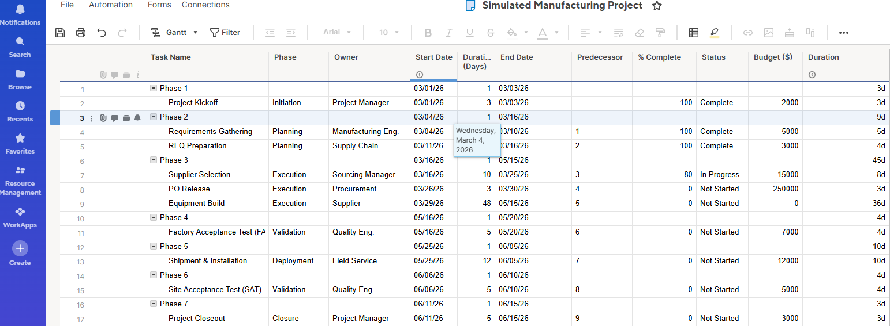
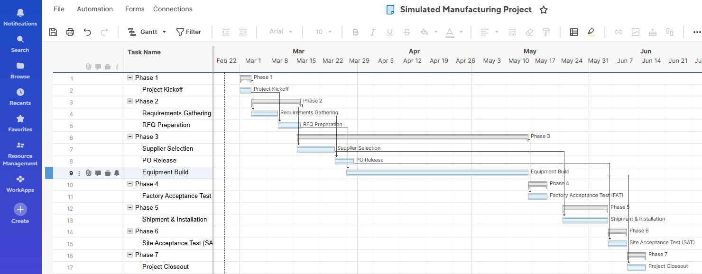

# Project Management
# Manufacturing Project Operations – Smartsheet Project Plan

## Overview
This project showcases how I plan and track a manufacturing capital equipment project using Smartsheet-style project management practices (schedule, dependencies, milestones, owners, and budget tracking).

**Context:** Classroom-simulated manufacturing operations project

---

## What I Built
- A structured project plan covering end-to-end execution for a capital equipment program (RFQ → PO → Build → FAT → Install → SAT → Closeout)
- Task-level ownership, dependencies, duration estimates, and milestone tracking
- Budget placeholders and progress tracking fields
- A Smartsheet implementation with screenshots of:
  - Project Sheet view
  - Gantt chart view

---

## Artifacts
### 1) Project Plan Template (Excel)
-  [View Excel Project Plan](Manufacturing-Project-Simulation.xlsx) 
- Columns included:
  - Task ID, Task Name, Phase, Owner, Start/End Dates, Duration, Predecessors
  - % Complete, Status, Budget

### 2) Smartsheet Screenshots
### 📋 Project Overview

### 📊 Gantt Chart Timeline

> Note: Screenshots reflect the same structure as the Excel template, implemented in Smartsheet to show schedule + Gantt tracking.

---

## Project Phases
1. Initiation – kickoff + scope alignment  
2. Planning – requirements, RFQ package preparation  
3. Execution – supplier selection, PO release, equipment build  
4. Validation – FAT/SAT planning and execution  
5. Deployment – shipment, install, ramp readiness  
6. Closure – handoff and lessons learned

---

## Metrics
- **12-week plan** with **25+ trackable tasks**
- **Milestone-based tracking** (Kickoff, RFQ Complete, PO Release, FAT, SAT, Closeout)
- **Dependency logic** - to reflect real manufacturing constraints

---

## How This Maps to Manufacturing Project Operations Work?
- Cross-functional coordination (Eng, Quality, Supplier, Procurement)
- Schedule management with dependencies + critical path awareness
- Budget visibility + capex tracking placeholders
- Execution governance: milestones, deliverables, and status reporting

---

# Project Charter

## Project
Capital Equipment Deployment for a Manufacturing Line

## Objective
Deploy and validate new capital equipment to improve throughput, quality, and line readiness.

## Scope
- RFQ → Supplier selection → PO → Build → FAT → Install → SAT → Closeout
- Schedule, budget tracking, milestones, and dependency management

## Out of Scope
- Actual supplier contracts, proprietary specs, and real company data

## Key Stakeholders
- Manufacturing Engineering
- Quality Engineering
- Procurement / Supply Chain
- Supplier / Field Service
- Project Operations (PM)

## Deliverables
- Project plan with dependencies and milestones
- FAT/SAT checklist readiness gates
- Closeout report (lessons learned template)

## Risks (examples)
- Supplier lead time slip
- Test failures at FAT/SAT
- Install window constraints
- BOM/spec change impacts

## Success Criteria
- On-time milestone completion
- FAT/SAT pass with documented actions
- Smooth handoff to operations with minimal downtime

---

# Risk Register Template

| Risk ID | Risk | Impact | Probability | Owner | Mitigation | Trigger | Status |
|---|---|---|---|---|---|---|---|
| R1 | Supplier lead time slip | High | Med | SCM | Weekly supplier check-ins; buffer in schedule | Missed interim build milestone | Open |
| R2 | FAT failure | High | Low/Med | QE | Pre-FAT checklist; test plan review | Failure during run-off | Open |
| R3 | Install window limited | Med | Med | MFG Eng | Coordinate line downtime early | Ops schedule conflict | Open |
